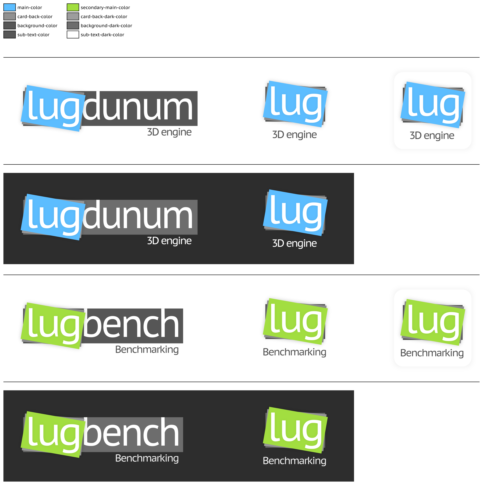

# Lugdunum's Visual Identity

This repository attemps to describe the Lugdunum's Game Engine visual identity.

## Logo

## Colors

<table>
  <tr>
    <td></td>
    <td></td>
    <td></td>
    <td></td>
    <td></td>
    <td></td>
    <td></td>
  </tr>
  <tr>
    <td>blue</td>
    <td>flashy blue</td>
    <td>turquoise</td>
    <td>green</td>
    <td>orange</td>
    <td>red</td>
    <td>flashy pink</td>
  </tr>
  <tr>
    <td><code>#5cbdff</code></td>
    <td><code>#3fdcf8</code></td>
    <td><code>#55f0bb</code></td>
    <td><code>#ade300</code></td>
    <td><code>#ffa12b</code></td>
    <td><code>#e40000</code></td>
    <td><code>#ff3689</code></td>
  </tr>
</table>
